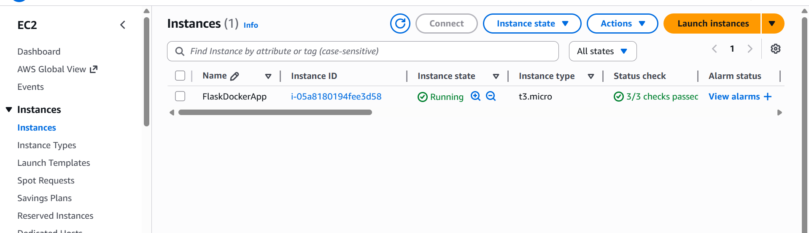

# Multi-Container App on EC2

This project deploys a two-tier application (Flask + MySQL) on AWS EC2 using Docker Compose and Terraform.

## Application Architecture



The application consists of:

- **Web Layer**: Flask application running in a Docker container (port 5000).
- **Database Layer**: MySQL database running in a Docker container (port 3306).

## Deployment Instructions

### Prerequisites

- AWS Credentials configured
- Terraform installed
- Git installed

### Steps

1. **Clone the repository**

   ```bash
   git clone https://github.com/valensniyonkuru/Multi-Container-App.git
   cd Multi-Container-App
   ```

2. **Deploy Infrastructure**

   ```bash
   cd terraform
   terraform init
   terraform apply -auto-approve
   ```

3. **Verify Deployment**
   The Terraform output will provide the public IP of the EC2 instance. Access the application at:
   `http://<EC2_PUBLIC_IP>:5000`

   You should see a message retrieved from the MySQL database.

## Directory Structure

- `web/`: Flask application source code.
- `db/`: Database initialization scripts.
- `terraform/`: Infrastructure validation code.
- `image/`: Documentation assets.
- `docker-compose.yml`: Container orchestration configuration.
